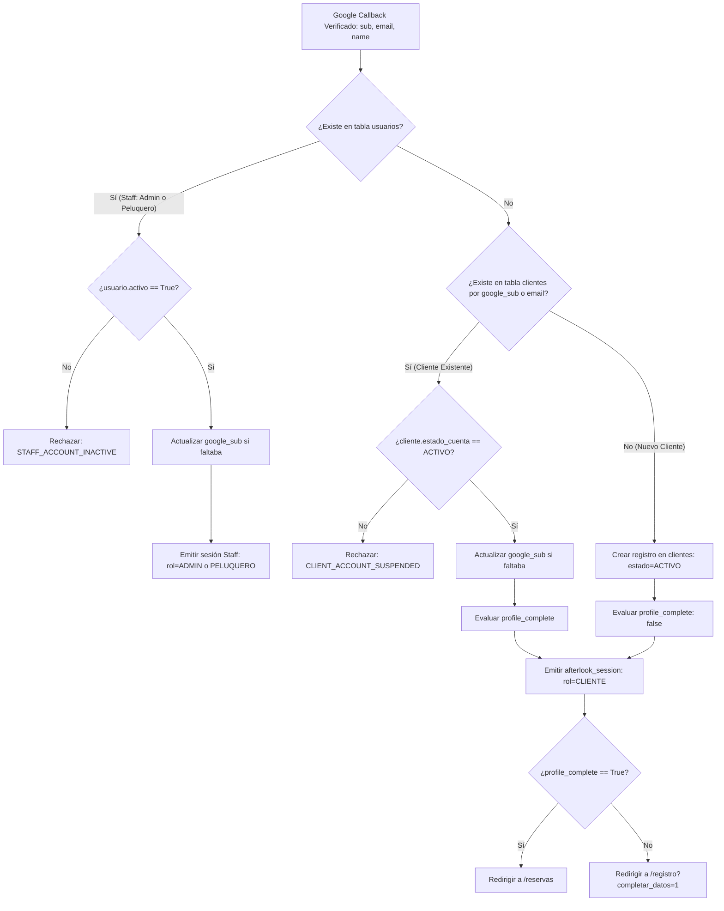
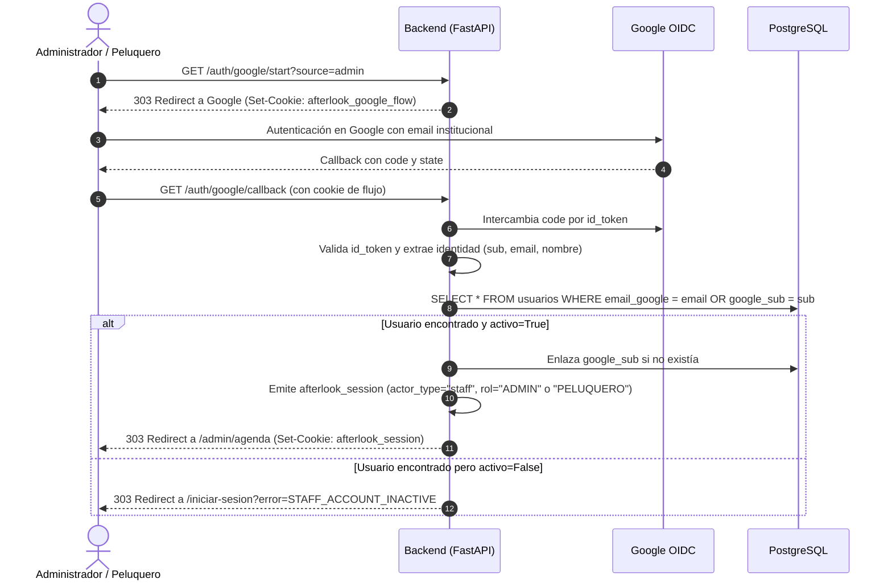

# Arquitectura de Autenticación con Google OAuth 2.0 / OpenID Connect
## Adaptada, Perfeccionada y Alineada para After Look (Peluquería Sergio)

Este documento define la **arquitectura técnica definitiva**, el **diseño de seguridad criptográfica**, el **modelo de datos** y la **estrategia de integración modular** de Google OAuth 2.0 / OpenID Connect para **After Look (Peluquería Sergio)**.

Sustituye y supera el diseño del proyecto anterior, integrando armónicamente:
* **ADR-002:** Separación estricta entre `clientes` y `usuarios` internos (Admin y Peluqueros).
* **Casos de Uso Principales:** CU-001 (*Login con Google*) y CU-002 (*Completar datos del cliente*).
* **Arquitectura Hexagonal (Puertos y Adaptadores - DIP/ISP de TASK-02):** Desacoplamiento total del caso de uso respecto al SDK de Google mediante `IdentityProvider` y `VerifiedIdentity`.
* **Requisitos No Funcionales:** RNF-SEG-01 (*Cero contraseñas de clientes en BD*), RNF-SEG-02 (*Identidades individuales auditables*), RNF-SEG-05 (*Secretos en entorno*) y RNF-MAN-03 (*Logs estructurados sin PII*).
* **Stack Tecnológico Vigente:** FastAPI (asíncrono con `asyncpg` y SQLAlchemy 2.0 Mapped), Pydantic Settings v2, Frontend en Astro y migraciones con Alembic.

---

## 1. Cuadro Comparativo: Proyecto Anterior vs. Proyecto Actual (After Look)

| Dimensión | Proyecto Anterior (Genérico) | Proyecto Actual (After Look) | Adaptación y Mejora Aplicada |
| :--- | :--- | :--- | :--- |
| **Modelo de Actores** | Tabla única `usuarios` para todos los roles. | **ADR-002:** Separación estricta entre `clientes` (externos) y `usuarios` (internos: Admin, Peluqueros). | Se adopta resolución dual: identificación de staff preconfigurado vs. auto-registro seguro de clientes. |
| **Credenciales y Password** | Híbrido: email + contraseña local (Argon2) con vinculación opcional (`flow=link`). | **100% Google OIDC (Passwordless):** Ni clientes ni usuarios requieren contraseñas locales (RNF-SEG-01). | Se elimina la sobrecarga de hashes de contraseñas locales para clientes; se erradica el riesgo de credenciales débiles. |
| **Identificador Inmutable** | Introducía `google_sub` en tabla única. | La BD inicial solo disponía de `email_google`. | **Mejora crítica:** Se agrega `google_sub` único e indexado en `clientes` y `usuarios`, protegiendo la identidad ante cambios de email en Google. |
| **Arquitectura de Software** | Acoplamiento directo del servicio con librerías de Google. | **Arquitectura Hexagonal (DIP/ISP):** Puerto `IdentityProvider` y adaptador `GoogleOIDCAdapter`. | El dominio no importa FastAPI ni SDKs de Google. Facilita mocks en tests unitarios sin red (TASK-02). |
| **Onboarding de Cliente (CU-002)** | Solo contemplaba nombre visible (`display_name`). | Requiere teléfono/WhatsApp para confirmaciones (CU-002). | El token de sesión (`afterlook_session`) incluye `profile_complete: bool`. Si es `False`, el frontend guía al cliente a completar sus datos. |
| **Gestión de Cookies** | `fire_control_access` y `fire_control_google_flow`. | `afterlook_session` y `afterlook_google_flow`. | Aisladas con `HttpOnly`, `SameSite=Lax` y `Path` estricto; rotación y expiración inmediata de la cookie de flujo tras el callback. |
| **Frontend** | Genérico / SPA. | **Astro** (`registro.astro`, `reservas.astro`). | Conexión directa del botón a `/auth/google/start` con captura y limpieza de errores vía `history.replaceState`. |

---

## 2. Decisiones Arquitectónicas Principales (ADRs)

### 2.1. Flujo OAuth en Servidor con PKCE, State y Nonce
* **Decisión:** El frontend jamás gestiona credenciales de Google ni procesa tokens. La autorización completa reside en el backend (FastAPI).
* **Mecanismo:**
  1. Frontend inicia navegación hacia `GET /auth/google/start?source=web`.
  2. Backend genera criptográficamente:
     * `state`: Token aleatorio seguro (32 bytes urlsafe) para evitar ataques CSRF.
     * `nonce`: Token aleatorio seguro (32 bytes urlsafe) para mitigar ataques de repetición del `id_token`.
     * `verifier`: Secreto PKCE (64 bytes urlsafe).
     * `code_challenge`: Hash SHA-256 en Base64URL (`S256`).
     * `attempt_id`: Identificador efímero de auditoría (24 caracteres hex).
  3. Backend guarda el estado efímero en la cookie firmada `afterlook_google_flow` y devuelve una redirección `303 See Other` a Google.
  4. Google redirige al usuario a `GET /auth/google/callback?code=...&state=...`.
  5. Backend intercambia el código de autorización por los tokens llamando a Google (`https://oauth2.googleapis.com/token`) con `client_secret` y `code_verifier`.
  6. Backend valida criptográficamente el `id_token` (firma RS256, audiencia, emisor, vigencia, `email_verified=true` y `nonce`).

### 2.2. Estado Efímero sin Base de Datos ni Redis (`afterlook_google_flow`)
* **Decisión:** Almacenar el estado intermedio en una cookie HTTP firmada mediante JWT (HS256) con el `SECRET_KEY` del backend.
* **Seguridad:**
  * TTL corto de 5 minutos.
  * Restricciones: `HttpOnly=True`, `SameSite="lax"`, `Path="/auth/google"`.
  * La cookie se invalida de inmediato (`Max-Age=0`) al completar o rechazar el callback.
  * No requiere Redis ni tablas temporales en PostgreSQL.

### 2.3. Resolución de Identidad Dual: Clientes vs. Personal Interno
Al recibir la identidad verificada de Google (`sub`, `email`, `name`):



#### Reglas de Negocio Asociadas:
1. **Prioridad de Staff:** Si el email pertenece a un usuario interno preconfigurado (`usuarios`), se autentica como personal operativo con su rol correspondiente (`ADMIN` o `PELUQUERO`).
2. **Auto-registro Exclusivo para Clientes:** Los usuarios internos no se auto-registran desde Google; se crean por seed o panel administrativo. Si un email desconocido inicia sesión, siempre se crea como `Cliente`.
3. **Inmutabilidad por `google_sub`:** Una vez asociado el `google_sub`, los accesos futuros se resuelven por este identificador único inmutable, protegiendo al sistema ante eventuales cambios de dirección de correo electrónico en Google.
4. **Validación de Estado Operativo:**
   - Si un peluquero o admin tiene `activo = False`, no puede acceder.
   - Si un cliente tiene `estado_cuenta != 'ACTIVO'` (`SUSPENDIDO` o `INACTIVO`), se rechaza el acceso con error amigable.

### 2.4. Ciclo de Onboarding y Completitud de Perfil (CU-002)
Google solo garantiza `email`, `sub` y nombre visible. Las reglas del salón requieren teléfono/WhatsApp para coordinar el turno (CU-002):
* La sesión JWT incluye el claim `profile_complete: bool` (`True` si `cliente.telefono` o `cliente.whatsapp` están presentes).
* Si `profile_complete == False`, la redirección tras el login lleva a la vista de completar datos antes de permitir confirmar reservas.

### 2.5. Cookie de Sesión Local Canónica (`afterlook_session`)
* Tras autenticar, el backend emite una cookie de sesión propia:
  * Nombre: `afterlook_session`.
  * Formato: JWT firmado con HS256.
  * TTL: 8 horas (o configurable según entorno).
  * Atributos: `HttpOnly=True`, `SameSite="lax"`, `Path="/"`, `Secure` (en prod).
  * Contenido (claims):
    ```json
    {
      "sub": 42,
      "actor_type": "cliente",
      "rol": "CLIENTE",
      "email": "cliente@example.com",
      "nombre": "Juan Pérez",
      "profile_complete": false,
      "exp": 1728168000
    }
    ```

---

## 3. Diagramas de Secuencia

### 3.1. Flujo de Login y Registro de Cliente con Onboarding (CU-001 & CU-002)

```mermaid
sequenceDiagram
    autonumber
    actor C as Cliente (Navegador)
    participant F as Frontend (Astro)
    participant B as Backend (FastAPI - Identity)
    participant G as Google OIDC Provider
    participant DB as PostgreSQL (clientes / usuarios)

    C->>F: Clic en "Continuar con Google"
    F->>B: GET /auth/google/start?source=web
    B->>B: Genera attempt_id, state, nonce, PKCE (verifier + challenge S256)
    B->>B: Codifica afterlook_google_flow (JWT firmado, exp 5m)
    B-->>C: 303 Redirect a Google (Set-Cookie: afterlook_google_flow)
    C->>G: Autoriza acceso en Google (Consent Screen)
    G-->>C: Redirige a GET /auth/google/callback?code=CODE&state=STATE
    C->>B: GET /auth/google/callback (con afterlook_google_flow)
    B->>B: Valida y consume afterlook_google_flow; verifica state
    B->>G: POST /token (code + verifier + client_secret)
    G-->>B: Retorna { id_token, access_token }
    B->>B: Valida firma de id_token, aud, iss, exp, email_verified y nonce
    B->>DB: Busca en tabla usuarios por google_sub o email
    Note over B,DB: No es staff interno
    B->>DB: Busca en tabla clientes por google_sub o email
    alt Cliente nuevo
        B->>DB: INSERT INTO clientes (nombre, email_google, google_sub, estado_cuenta='ACTIVO')
    else Cliente existente
        B->>DB: UPDATE clientes SET google_sub = sub (si no estaba enlazado)
    end
    B->>B: Evalúa si teléfono o whatsapp están completos (CU-002)
    B->>B: Genera token de sesión JWT afterlook_session
    alt Datos de contacto pendientes (CU-002)
        B-->>C: 303 Redirect a /registro?completar_datos=1 (Set-Cookie: afterlook_session; Expire flow)
        C->>F: Carga formulario para completar teléfono / WhatsApp
    else Datos completos
        B-->>C: 303 Redirect a /reservas (Set-Cookie: afterlook_session; Expire flow)
        C->>F: Ingresa directamente a reservar turno (CU-003)
    end
```

---

### 3.2. Flujo de Login de Personal Interno (Admin / Peluquero)



---

## 4. Modelo de Datos y Migración Alembic

### 4.1. Modificaciones Requeridas en las Tablas
Para asegurar la inmutabilidad y la trazabilidad de identidades en PostgreSQL:

1. **Tabla `clientes`:**
   * Agregar columna `google_sub: VARCHAR(255) NULL UNIQUE`.
   * Mantener `email_google: VARCHAR(254) NOT NULL UNIQUE`.
2. **Tabla `usuarios`:**
   * Agregar columna `google_sub: VARCHAR(255) NULL UNIQUE`.
   * Mantener `email_google: VARCHAR(254) NOT NULL UNIQUE`.

### 4.2. Declaración en SQLAlchemy (`app/modules/services/shared/models.py`)

```python
# En User (usuarios):
google_sub: Mapped[str | None] = mapped_column(
    String(255), unique=True, nullable=True, index=True
)

# En Client (clientes):
google_sub: Mapped[str | None] = mapped_column(
    String(255), unique=True, nullable=True, index=True
)
```

### 4.3. Migración Alembic (`migrations/versions/20261005_02_google_oauth.py`)

```python
"""add_google_sub_to_clientes_and_usuarios

Revision ID: 20261005_02_google_oauth
Revises: 20260920_01_reservation_integrity
Create Date: 2026-10-05
"""
from alembic import op
import sqlalchemy as sa

revision = "20261005_02_google_oauth"
down_revision = "20260920_01_reservation_integrity"
branch_labels = None
depends_on = None

def upgrade() -> None:
    # 1. clientes
    op.add_column("clientes", sa.Column("google_sub", sa.String(255), nullable=True))
    op.create_unique_constraint("uq_clientes_google_sub", "clientes", ["google_sub"])
    op.create_index("ix_clientes_google_sub", "clientes", ["google_sub"])

    # 2. usuarios
    op.add_column("usuarios", sa.Column("google_sub", sa.String(255), nullable=True))
    op.create_unique_constraint("uq_usuarios_google_sub", "usuarios", ["google_sub"])
    op.create_index("ix_usuarios_google_sub", "usuarios", ["google_sub"])

def downgrade() -> None:
    op.drop_index("ix_usuarios_google_sub", table_name="usuarios")
    op.drop_constraint("uq_usuarios_google_sub", "usuarios", type_="unique")
    op.drop_column("usuarios", "google_sub")

    op.drop_index("ix_clientes_google_sub", table_name="clientes")
    op.drop_constraint("uq_clientes_google_sub", "clientes", type_="unique")
    op.drop_column("clientes", "google_sub")
```

---

## 5. Arquitectura Hexagonal y Módulos Backend (`app/modules/identity/`)

Siguiendo el diseño establecido en `TASK-02`, el módulo desacopla el caso de uso respecto al SDK de Google:

```
app/
├── config/
│   └── settings.py               # Añade variables google_* tipadas
└── modules/
    └── identity/
        ├── __init__.py
        ├── google_port.py        # DIP: Contrato IdentityProvider y VerifiedIdentity
        ├── google_adapter.py     # Implementación concreta OIDC con Google (httpx + id_token)
        ├── google_flow.py        # Cookie firmada de estado efímero (PKCE, state, nonce)
        ├── service.py            # Caso de uso: resolución y registro de Client / User, CU-001 y CU-002
        ├── session.py            # Creación y verificación de cookie afterlook_session
        ├── observability.py      # Logs estructurados sin PII con attempt_id
        ├── schemas.py            # DTOs de sesión y perfil
        └── router.py             # Endpoints /auth/google/start, /auth/google/callback, /auth/logout
```

### 5.1. Variables de Configuración (`app/config/settings.py`)

Se agregan a la clase `Settings`:

```python
# Google OAuth Configuration
google_client_id: str | None = None
google_client_secret: str | None = Field(default=None, repr=False)
google_redirect_uri: str | None = None
session_cookie_name: str = "afterlook_session"
session_ttl_minutes: int = 480  # 8 horas

@property
def google_oauth_enabled(self) -> bool:
    """Verifica si Google OAuth cuenta con configuración completa."""
    return bool(
        self.google_client_id
        and self.google_client_secret
        and self.google_redirect_uri
    )
```

---

### 5.2. Puerto de Identidad (`app/modules/identity/google_port.py`)

Alineado con el principio de inversión de dependencias:

```python
"""Provider-independent contracts for verified external identities."""

from dataclasses import dataclass
from typing import Protocol


@dataclass(frozen=True, slots=True)
class VerifiedIdentity:
    """Identity claims accepted after cryptographic provider verification."""

    subject: str
    email: str
    name: str | None


class IdentityProvider(Protocol):
    """Exchange an authorization code for one verified identity."""

    async def exchange_code(
        self, *, code: str, expected_nonce: str, code_verifier: str
    ) -> VerifiedIdentity:
        """Validate the provider response and return trusted claims."""
        ...
```

---

### 5.3. Adaptador Concreto Google OIDC (`app/modules/identity/google_adapter.py`)

```python
import base64
import hashlib
import secrets
from urllib.parse import urlencode
import httpx
from fastapi.concurrency import run_in_threadpool
from google.auth.transport.requests import Request as GoogleRequest
from google.oauth2 import id_token

from app.modules.identity.google_port import IdentityProvider, VerifiedIdentity

AUTHORIZATION_ENDPOINT = "https://accounts.google.com/o/oauth2/v2/auth"
TOKEN_ENDPOINT = "https://oauth2.googleapis.com/token"

class GoogleOAuthError(Exception):
    def __init__(self, code: str, detail: str = "") -> None:
        self.code = code
        self.detail = detail
        super().__init__(f"{code}: {detail}")

class GoogleOIDCAdapter(IdentityProvider):
    def __init__(self, client_id: str, client_secret: str, redirect_uri: str) -> None:
        self.client_id = client_id
        self.client_secret = client_secret
        self.redirect_uri = redirect_uri

    def build_authorization_url(self, *, state: str, nonce: str, verifier: str) -> str:
        digest = hashlib.sha256(verifier.encode("ascii")).digest()
        code_challenge = base64.urlsafe_b64encode(digest).rstrip(b"=").decode("ascii")

        params = {
            "client_id": self.client_id,
            "redirect_uri": self.redirect_uri,
            "response_type": "code",
            "scope": "openid email profile",
            "state": state,
            "nonce": nonce,
            "code_challenge": code_challenge,
            "code_challenge_method": "S256",
            "prompt": "select_account",
        }
        return f"{AUTHORIZATION_ENDPOINT}?{urlencode(params)}"

    async def exchange_code(
        self, *, code: str, expected_nonce: str, code_verifier: str
    ) -> VerifiedIdentity:
        async with httpx.AsyncClient(timeout=10.0) as client:
            response = await client.post(
                TOKEN_ENDPOINT,
                data={
                    "code": code,
                    "client_id": self.client_id,
                    "client_secret": self.client_secret,
                    "redirect_uri": self.redirect_uri,
                    "grant_type": "authorization_code",
                    "code_verifier": code_verifier,
                },
            )
            if response.status_code != 200:
                raise GoogleOAuthError("GOOGLE_EXCHANGE_FAILED")
            
            payload = response.json()
            raw_id_token = payload.get("id_token")
            if not raw_id_token:
                raise GoogleOAuthError("GOOGLE_INVALID_TOKEN_RESPONSE")

        try:
            claims = await run_in_threadpool(
                id_token.verify_oauth2_token,
                raw_id_token,
                GoogleRequest(),
                self.client_id,
            )
            sub = claims.get("sub")
            email = claims.get("email")
            email_verified = claims.get("email_verified") in (True, "true")
            actual_nonce = claims.get("nonce")

            if not sub or not email or not email_verified:
                raise GoogleOAuthError("GOOGLE_UNVERIFIED_EMAIL")
            if not actual_nonce or not secrets.compare_digest(actual_nonce, expected_nonce):
                raise GoogleOAuthError("GOOGLE_NONCE_MISMATCH")

            return VerifiedIdentity(
                subject=sub,
                email=email.strip().lower(),
                name=claims.get("name"),
            )
        except Exception as exc:
            if isinstance(exc, GoogleOAuthError):
                raise
            raise GoogleOAuthError("GOOGLE_VALIDATION_FAILED") from exc
```

---

### 5.4. Estado Efímero Firmado (`app/modules/identity/google_flow.py`)

```python
import secrets
from dataclasses import dataclass
from datetime import UTC, datetime, timedelta
import jwt

GOOGLE_FLOW_COOKIE = "afterlook_google_flow"
GOOGLE_FLOW_TTL = timedelta(minutes=5)

@dataclass(frozen=True)
class GoogleFlow:
    attempt_id: str
    state: str
    nonce: str
    verifier: str
    source: str

def new_google_flow(source: str = "web") -> GoogleFlow:
    return GoogleFlow(
        attempt_id=secrets.token_hex(12),
        state=secrets.token_urlsafe(32),
        nonce=secrets.token_urlsafe(32),
        verifier=secrets.token_urlsafe(64),
        source=source,
    )

def encode_google_flow(flow: GoogleFlow, secret_key: str) -> str:
    return jwt.encode(
        {
            "type": "afterlook_flow",
            "attempt_id": flow.attempt_id,
            "state": flow.state,
            "nonce": flow.nonce,
            "verifier": flow.verifier,
            "source": flow.source,
            "exp": datetime.now(UTC) + GOOGLE_FLOW_TTL,
        },
        secret_key,
        algorithm="HS256",
    )

def decode_google_flow(token: str, secret_key: str) -> GoogleFlow:
    claims = jwt.decode(
        token,
        secret_key,
        algorithms=["HS256"],
        options={"require": ["type", "attempt_id", "state", "nonce", "verifier", "source", "exp"]},
    )
    if claims.get("type") != "afterlook_flow":
        raise ValueError("Invalid flow type")
    return GoogleFlow(
        attempt_id=claims["attempt_id"],
        state=claims["state"],
        nonce=claims["nonce"],
        verifier=claims["verifier"],
        source=claims["source"],
    )
```

---

### 5.5. Caso de Uso de Dominio (`app/modules/identity/service.py`)

Resuelve la distinción entre `User` (personal interno) y `Client` (clientes de la peluquería):

```python
from dataclasses import dataclass
from sqlalchemy import select
from sqlalchemy.ext.asyncio import AsyncSession
from sqlalchemy.orm import selectinload

from app.modules.services.shared.domain_types import ClientAccountStatus
from app.modules.services.shared.models import Client, User
from app.modules.identity.google_port import IdentityProvider, VerifiedIdentity
from app.modules.identity.google_adapter import GoogleOAuthError

@dataclass(frozen=True)
class ResolvedActor:
    actor_id: int
    actor_type: str  # "staff" | "cliente"
    role: str        # "ADMIN" | "PELUQUERO" | "CLIENTE"
    email: str
    nombre: str
    profile_complete: bool

async def authenticate_identity(
    session: AsyncSession,
    provider: IdentityProvider,
    *,
    code: str,
    expected_nonce: str,
    code_verifier: str,
) -> ResolvedActor:
    """Verifica identidad en proveedor OIDC y resuelve o registra el actor local."""
    identity = await provider.exchange_code(
        code=code,
        expected_nonce=expected_nonce,
        code_verifier=code_verifier,
    )

    # 1. Comprobar si corresponde a un usuario interno (usuarios)
    user_stmt = (
        select(User)
        .options(selectinload(User.rol))
        .where((User.google_sub == identity.subject) | (User.email_google == identity.email))
    )
    user = await session.scalar(user_stmt)
    if user is not None:
        if not user.activo:
            raise GoogleOAuthError("STAFF_ACCOUNT_INACTIVE")
        
        # Enlazar google_sub si ingresa por primera vez
        if user.google_sub is None:
            user.google_sub = identity.subject
            await session.commit()

        return ResolvedActor(
            actor_id=user.id,
            actor_type="staff",
            role=user.rol.nombre if user.rol else "PELUQUERO",
            email=user.email_google,
            nombre=user.nombre_completo,
            profile_complete=True,
        )

    # 2. Es un cliente (clientes)
    client_stmt = select(Client).where(
        (Client.google_sub == identity.subject) | (Client.email_google == identity.email)
    )
    client = await session.scalar(client_stmt)

    if client is not None:
        if client.estado_cuenta != ClientAccountStatus.ACTIVE.value:
            raise GoogleOAuthError("CLIENT_ACCOUNT_SUSPENDED")

        if client.google_sub is None:
            client.google_sub = identity.subject
            await session.commit()
    else:
        # CU-001: Auto-registro de nuevo cliente
        nombre_cliente = identity.name.strip() if identity.name else "Cliente After Look"
        client = Client(
            nombre=nombre_cliente,
            email_google=identity.email,
            google_sub=identity.subject,
            estado_cuenta=ClientAccountStatus.ACTIVE.value,
        )
        session.add(client)
        await session.commit()
        await session.refresh(client)

    # CU-002: Verificar si teléfono o WhatsApp están completos
    has_contact = bool(client.telefono or client.whatsapp)

    return ResolvedActor(
        actor_id=client.id,
        actor_type="cliente",
        role="CLIENTE",
        email=client.email_google,
        nombre=client.nombre,
        profile_complete=has_contact,
    )
```

---

### 5.6. Gestión de Sesión Canónica (`app/modules/identity/session.py`)

```python
from datetime import UTC, datetime, timedelta
import jwt
from fastapi import Response
from app.modules.identity.service import ResolvedActor

def issue_session_cookie(
    response: Response,
    actor: ResolvedActor,
    secret_key: str,
    cookie_name: str = "afterlook_session",
    ttl_minutes: int = 480,
    secure: bool = False,
) -> None:
    payload = {
        "sub": actor.actor_id,
        "actor_type": actor.actor_type,
        "role": actor.role,
        "email": actor.email,
        "nombre": actor.nombre,
        "profile_complete": actor.profile_complete,
        "exp": datetime.now(UTC) + timedelta(minutes=ttl_minutes),
    }
    token = jwt.encode(payload, secret_key, algorithm="HS256")
    response.set_cookie(
        key=cookie_name,
        value=token,
        max_age=ttl_minutes * 60,
        httponly=True,
        samesite="lax",
        secure=secure,
        path="/",
    )

def clear_session_cookie(response: Response, cookie_name: str = "afterlook_session") -> None:
    response.delete_cookie(key=cookie_name, path="/")
```

---

### 5.7. Endpoints del Router (`app/modules/identity/router.py`)

```python
import secrets
from fastapi import APIRouter, Depends, HTTPException, Query, Request, status
from fastapi.responses import RedirectResponse
from sqlalchemy.ext.asyncio import AsyncSession

from app.config.settings import Settings, get_settings
from app.infrastructure.database.session import get_session
from app.modules.identity.google_adapter import GoogleOIDCAdapter, GoogleOAuthError
from app.modules.identity.google_flow import (
    GOOGLE_FLOW_COOKIE,
    decode_google_flow,
    encode_google_flow,
    new_google_flow,
)
from app.modules.identity.service import authenticate_identity
from app.modules.identity.session import issue_session_cookie, clear_session_cookie

router = APIRouter(prefix="/auth/google", tags=["Identity"])

@router.get("/start")
async def google_auth_start(
    source: str = Query("web"),
    settings: Settings = Depends(get_settings),
) -> RedirectResponse:
    if not settings.google_oauth_enabled:
        raise HTTPException(
            status_code=status.HTTP_503_SERVICE_UNAVAILABLE,
            detail="GOOGLE_NOT_CONFIGURED",
        )

    flow = new_google_flow(source=source)
    adapter = GoogleOIDCAdapter(
        client_id=settings.google_client_id,
        client_secret=settings.google_client_secret,
        redirect_uri=settings.google_redirect_uri,
    )
    auth_url = adapter.build_authorization_url(
        state=flow.state,
        nonce=flow.nonce,
        verifier=flow.verifier,
    )

    response = RedirectResponse(url=auth_url, status_code=status.HTTP_303_SEE_OTHER)
    response.set_cookie(
        key=GOOGLE_FLOW_COOKIE,
        value=encode_google_flow(flow, settings.secret_key),
        max_age=300,
        httponly=True,
        samesite="lax",
        secure=(settings.environment == "production"),
        path="/auth/google",
    )
    return response

@router.get("/callback")
async def google_auth_callback(
    request: Request,
    code: str | None = None,
    state: str | None = None,
    error: str | None = None,
    settings: Settings = Depends(get_settings),
    db: AsyncSession = Depends(get_session),
) -> RedirectResponse:
    frontend_login_url = "/registro"

    # 1. Comprobar si el usuario canceló en Google
    if error:
        res = RedirectResponse(f"{frontend_login_url}?auth_error=GOOGLE_ACCESS_DENIED", status_code=303)
        res.delete_cookie(GOOGLE_FLOW_COOKIE, path="/auth/google")
        return res

    # 2. Validar presencia de cookie y parámetros
    flow_cookie = request.cookies.get(GOOGLE_FLOW_COOKIE)
    if not flow_cookie or not code or not state:
        res = RedirectResponse(f"{frontend_login_url}?auth_error=GOOGLE_SESSION_EXPIRED", status_code=303)
        res.delete_cookie(GOOGLE_FLOW_COOKIE, path="/auth/google")
        return res

    try:
        flow = decode_google_flow(flow_cookie, settings.secret_key)
        if not secrets.compare_digest(flow.state, state):
            raise GoogleOAuthError("GOOGLE_STATE_MISMATCH")

        adapter = GoogleOIDCAdapter(
            client_id=settings.google_client_id,
            client_secret=settings.google_client_secret,
            redirect_uri=settings.google_redirect_uri,
        )

        # 3. Autenticación de identidad delegada mediante el puerto/servicio
        actor = await authenticate_identity(
            db,
            adapter,
            code=code,
            expected_nonce=flow.nonce,
            code_verifier=flow.verifier,
        )

    except GoogleOAuthError as err:
        res = RedirectResponse(f"{frontend_login_url}?auth_error={err.code}", status_code=303)
        res.delete_cookie(GOOGLE_FLOW_COOKIE, path="/auth/google")
        return res
    except Exception:
        res = RedirectResponse(f"{frontend_login_url}?auth_error=GOOGLE_AUTH_FAILED", status_code=303)
        res.delete_cookie(GOOGLE_FLOW_COOKIE, path="/auth/google")
        return res

    # 4. Redirección contextual según tipo de actor y CU-002
    if actor.actor_type == "staff":
        target_url = "/admin"
    elif not actor.profile_complete:
        target_url = "/registro?completar_datos=1"  # CU-002
    else:
        target_url = "/reservas"                     # CU-003

    response = RedirectResponse(url=target_url, status_code=303)
    issue_session_cookie(
        response,
        actor,
        settings.secret_key,
        cookie_name=settings.session_cookie_name,
        ttl_minutes=settings.session_ttl_minutes,
        secure=(settings.environment == "production"),
    )
    response.delete_cookie(GOOGLE_FLOW_COOKIE, path="/auth/google")
    return response

@router.post("/logout")
async def logout(
    settings: Settings = Depends(get_settings),
) -> RedirectResponse:
    response = RedirectResponse(url="/", status_code=status.HTTP_303_SEE_OTHER)
    clear_session_cookie(response, settings.session_cookie_name)
    return response
```

---

## 6. Observabilidad y Auditoría Segura (`observability.py`)

* **Zero PII:** Prohibido registrar direcciones de email, nombres, tokens o códigos de autorización.
* **Correlación por `attempt_id`:** Cada intento de login se correlaciona con un identificador de 24 caracteres hexadecimales.
* **Uvicorn sin `--access-log` en endpoints sensibles:** Previene fugas de `code` y `state` en los logs del servidor web.

```python
import json
import logging

logger = logging.getLogger("afterlook.identity")

def log_oauth_event(event_name: str, attempt_id: str, success: bool, reason: str | None = None) -> None:
    data = {
        "event": "google_oauth",
        "action": event_name,
        "attempt_id": attempt_id,
        "success": success,
        "reason": reason,
    }
    if success:
        logger.info(json.dumps(data))
    else:
        logger.warning(json.dumps(data))
```

---

## 7. Integración Frontend (Astro) y Manejo de Errores

### 7.1. Botón Oficial en `frontend/src/pages/registro.astro`
El enlace que apuntaba estáticamente a `/reservas` se redirige al endpoint de inicio:

```html
<a class="google-register-button" href="http://127.0.0.1:8000/auth/google/start?source=web">
  <svg class="google-mark" viewBox="0 0 24 24" focusable="false" aria-hidden="true">
    <path fill="#4285F4" d="M23.52 12.27c0-.82-.07-1.6-.2-2.36H12v4.46h6.47a5.54 5.54 0 0 1-2.4 3.64v2.98h3.88c2.27-2.1 3.57-5.19 3.57-8.72Z" />
    <path fill="#34A853" d="M12 24c3.24 0 5.96-1.07 7.95-2.91l-3.88-2.98c-1.08.72-2.45 1.14-4.07 1.14-3.13 0-5.78-2.1-6.73-4.94H1.26v3.08A12 12 0 0 0 12 24Z" />
    <path fill="#FBBC05" d="M5.27 14.31A7.2 7.2 0 0 1 4.89 12c0-.8.14-1.58.38-2.31V6.61H1.26A12 12 0 0 0 0 12c0 1.93.46 3.76 1.26 5.39l4.01-3.08Z" />
    <path fill="#EA4335" d="M12 4.75c1.76 0 3.34.6 4.58 1.79l3.44-3.43A11.54 11.54 0 0 0 12 0 12 12 0 0 0 1.26 6.61l4.01 3.08C6.22 6.85 8.87 4.75 12 4.75Z" />
  </svg>
  <span>Continuar con Google</span>
</a>
```

### 7.2. Script Cliente: Procesamiento de Errores y Limpieza de URL

```javascript
// En el bloque <script> de registro.astro:
const ERROR_MESSAGES = {
  GOOGLE_NOT_CONFIGURED: "El acceso con Google no está disponible temporalmente.",
  GOOGLE_ACCESS_DENIED: "Has cancelado el inicio de sesión con Google.",
  GOOGLE_SESSION_EXPIRED: "La sesión de autenticación venció. Por favor, intentá de nuevo.",
  GOOGLE_AUTH_FAILED: "No pudimos validar tu cuenta de Google. Reintentá en unos momentos.",
  CLIENT_ACCOUNT_SUSPENDED: "Tu cuenta de cliente se encuentra suspendida. Contactá al salón.",
  STAFF_ACCOUNT_INACTIVE: "La cuenta de empleado se encuentra deshabilitada.",
};

const params = new URLSearchParams(window.location.search);
const authError = params.get("auth_error");
const completarDatos = params.get("completar_datos");

if (authError) {
  const mensaje = ERROR_MESSAGES[authError] || "Ocurrió un error al ingresar con Google.";
  alert(mensaje); // O renderizar toast/modal accesible
  window.history.replaceState(null, "", window.location.pathname);
} else if (completarDatos) {
  // Disparar modal o flujo de carga de teléfono/WhatsApp (CU-002)
  console.log("Requiere completar datos de contacto.");
}
```

---

## 8. Estrategia de Testing Automatizado (Unit & Integration)

Alineado con el diseño desacoplado de `google_port.py`, los tests implementan un `FakeIdentityProvider`:

```python
class FakeIdentityProvider:
    def __init__(self, identity: VerifiedIdentity | None = None, should_fail: bool = False):
        self.identity = identity
        self.should_fail = should_fail

    async def exchange_code(self, *, code: str, expected_nonce: str, code_verifier: str) -> VerifiedIdentity:
        if self.should_fail:
            raise GoogleOAuthError("GOOGLE_AUTH_FAILED")
        return self.identity
```

### Casos de Prueba Obligatorios:
1. **CU-001 (Cliente Nuevo):** Se crea un nuevo registro en `clientes`, `google_sub` poblado, `estado_cuenta='ACTIVO'`.
2. **CU-001 (Cliente Existente):** Segundo ingreso reutiliza la fila existente y enlaza `google_sub` si no lo tenía.
3. **CU-002 (Perfil Incompleto):** Cliente sin teléfono ni WhatsApp recibe `profile_complete=False` y redirige a `/registro?completar_datos=1`.
4. **Staff Login:** Un usuario de `usuarios` preconfigurado en seed ingresa y recibe `actor_type="staff"`, redirigiendo a `/admin`.
5. **Staff Inactivo:** Personal con `activo=False` es rechazado con `STAFF_ACCOUNT_INACTIVE`.
6. **Cliente Suspendido:** Cliente con `estado_cuenta='SUSPENDIDA'` es rechazado con `CLIENT_ACCOUNT_SUSPENDED`.
7. **Seguridad de Flujo:** Rechazo si `state` no coincide o si la cookie de flujo expiró.

## 9. Checklist de Implementación y Servidor Unificado

- [x] Instalar dependencia `google-auth[requests]>=2.0,<3.0` en `requirements.txt`.
- [x] Aplicar migración de base de datos para agregar `google_sub` en `clientes` y `usuarios` (`20261005_02`).
- [x] Incorporar variables `google_*` en `app/config/settings.py` y documentar en `.env.example`.
- [x] Implementar módulos en `app/modules/identity/` (`google_port.py`, `google_adapter.py`, `google_flow.py`, `service.py`, `session.py`, `router.py`, `observability.py`).
- [x] Montar `identity.router` y `StaticFiles` de `frontend/dist` en `app/main.py`.
- [x] Conectar enlace de Google en `frontend/src/pages/registro.astro` hacia `/auth/google/start?source=web`.
- [x] Ejecutar suite de pruebas unitarias y de integración (`pytest` 36/36 passed).

### Comando Único para Levantar Todo el Ecosistema

Para compilar el frontend y levantar tanto la interfaz web de Astro como el backend de FastAPI en un solo servidor en el puerto 8000:

```bash
make run
```

Endpoints del servidor unificado:
* `http://127.0.0.1:8000/` — Landing page de After Look.
* `http://127.0.0.1:8000/registro/` — Vista de registro con botón de Google OAuth.
* `http://127.0.0.1:8000/reservas/` — Catálogo de servicios y turnos.
* `http://127.0.0.1:8000/auth/google/start` — Inicio de autorización OIDC.
* `http://127.0.0.1:8000/auth/google/callback` — Recepción y emisión de sesión local.
* `http://127.0.0.1:8000/docs` — Documentación Swagger interactiva de la API.
